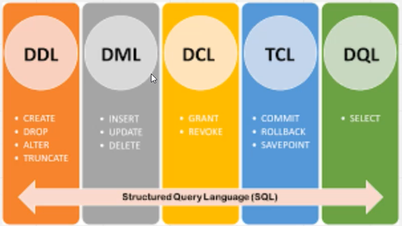

# SQL 

## 1. What is SQL? 
Structured Query Language is a standard language used to interact with relational database.It allows you to create, read, update and delete data as well as manage database structure.

## 2. Creating Tables 
Basic Syntax
```sql
CREATE TABLE  table_name (
    column1 datatype constraints,
    column2 datatype constraints,
    ...
    table_constraints
);
```
### Example: 
Employees Table
```sql
CREATE TABLE  Employees (
  EmployeeID int PRIMARY KEY,
  FirstName VARCHAR(50),
  LastName VARCHAR(50),
  Department VARCHAR(30),
  Salary DECIMAL(10,2),
  HireDate date
);
```

Department Table
```sql
CREATE TABLE Departments (
    DepartmentID INT PRIMARY KEY,
    DepartmentName VARCHAR(100) UNIQUE NOT NULL,
    ManagerID INT,
    Budget DECIMAL(15,2),
    Location VARCHAR(50)
);
```

Projects Table
```sql
CREATE TABLE  Projects (
  ProjectID int PRIMARY KEY,
  ProjectName VARCHAR(100) NOT null,
  Budget Decimal(12,2)
  StartDate Date,
  EndDate Date,
  Status VARCHAR(20) DEFAULT 'Active',
  CHECK (EndDate >= StartDate)
);
```

Employee-Project Junction Table
```sql
CREATE TABLE EmployeeProjects (
  EmployeeID INT,
  ProjectID INT,
  Role VARCHAR(50),
  HoursAllocated DECIMAL(5,2),
  PRIMARY KEY (EmployeeID, ProjectID),
  FOREIGN KEY (EmployeeID) REFERENCES Employees(EmployeeID),
  FOREIGN KEY (ProjectID) REFERENCES Projects(ProjectID)
);
```

Adding Foreign Key Constraints 
```sql
-- Add foreign key to Employees table after Departments is created
ALTER TABLE Employees 
ADD CONSTRAINT fk_department 
FOREIGN KEY (DepartmentID) REFERENCES Departments(DepartmentID);

-- Add foreign key for manager in Departments
ALTER TABLE Departments 
ADD CONSTRAINT fk_manager 
FOREIGN KEY (ManagerID) REFERENCES Employees(EmployeeID);
```
## 3. Common Data Types
| DATA TYPE | DESCRIPTION | EXAMPLE |
|----------|----------|----------|
| INT    | Integer numbers     | `Age INT`|
| VARCHAR(n)   | Variable-length strings     | `Name VARCHAR(50)`|
| CHAR(n)    | Fixed-length strings     | `CountryCode CHAR(2)`|
| DECIMAL(p,s)   | Fixed-point number     | `Price DECIMAL(10,2)`|
| DATE    | Data values     | `BirthDate DATE`|
| DATETIME    | Date and Time     | `CreatedAt DATETIME` |
| BOOLEAN    | True/False Value     | `IsActive BOOLEAN`|
| TEXT    | Long text strings     | `Description TEXT`|
| TIME    | HHMMSS     | `ChangeTime TIME`|
| TIMESTAMP    | Date & Time     | `InsertedTime TIMESTAMP`|

## 4. Constraints 
<b>Primary Key</b>

```sql
--Single Column 
EmployeeID INT PRIMARY KEY

--Multiple Column
PRIMARY KEY(EmployeeID, ProjectID)
```

<b>Foreign Key</b>

```sql
FOREIGN KEY (DepartmentID) references Department(DepartmentID)
```

<b> Other Constraints </b>

```sql
--NOT NULL
FirstName VARCHAR(50) NOT NULL

-- UNIQUE
Email VARCHAR(100) UNIQUE

-- DEFAULT
Status VARCHAR(20) DEFAULT 'Active'

-- CHECK
CHECK (Salary > 0)
CHECK (EndDate >= StartDate)
```

## 5. Basic SQL Operations
<b>Insert</b></br>

```sql
INSERT INTO Employees (EmployeeID, FirstName, LastName, DepartmentID, Salary, HireDate)
VALUES (1, 'John', 'Doe', 1, 50000.00, '2024-01-15');

--Insert multiple rows
INSERT INTO Employees VALUES 
(2, 'Jane', 'Smith', 2, 55000.00, '2024-02-01'),
(3, 'Bob', 'Johnson', 1, 48000.00, '2024-03-10');
```

<b>Select</b></br>

```sql
--Select all columns
SELECT * FROM Employees;

--Select specific columns
SELECT FirstName, LastName, Salary FROM Employees;

--With conditions
SELECT * FROM Employees WHERE Salary > 50000;

--With sorting
SELECT * FROM Employees ORDER BY Salary DESC;
```
<b>Update</b></br>

```sql
UPDATE Employees 
SET Salary = 52000.00 
WHERE EmployeeID = 1;

--Update multiple columns
UPDATE Employees 
SET Salary = Salary * 1.05, 
    DepartmentID = 2 
WHERE EmployeeID = 3;
```

<b>Delete</b></br>

```sql
DELETE FROM Employees WHERE EmployeeID = 3;

--Delete with conditions
DELETE FROM Employees WHERE Salary < 30000;
```



## 6. Advanced Queries

<b>Aggegrate Functions</b>

```sql
--Count the number of Employee 
select COUNT(*) FROM Employees 

-- Average salary by department
SELECT DepartmentID, AVG(Salary) as AvgSalary
FROM Employees
GROUP BY DepartmentID;

-- Department with highest total salary cost
SELECT DepartmentID, SUM(Salary) as TotalSalary
FROM Employees
GROUP BY DepartmentID
ORDER BY TotalSalary DESC
LIMIT 1;
```

<b> Sub Queries </b>

```sql
-- Employees earning above average
SELECT FirstName, LastName, Salary
FROM Employees
WHERE Salary > (SELECT AVG(Salary) FROM Employees);
```